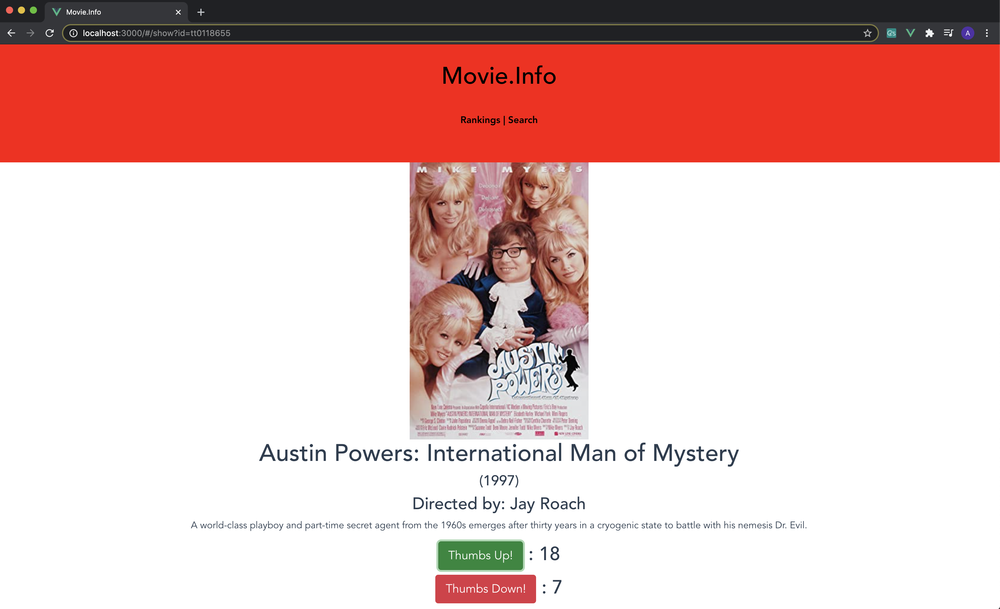

# Movie.Info

Movie.Info is a Ruby on Rails web application that allows you to search an online database for a movie and then rate that movie with either a thumbs up or thumbs down.
This application is deployed to https://yearonemovieinfo.herokuapp.com/ if you would like to try it out without setting it up locally.
## Installation
______

Movie.Info uses 
 * Ruby v2.7.1p83
 * Rails v6.0.3.4
 
### Clone the App
___

Click on the green CODE tab on the repository and use the clipboard to copy the github URL.


 

Then in your desired folder, type
```bash
git clone https://github.com/alanmannon/MovieApp.git
```

 

Once the repository is finished downloading, move into the folder that the application is in. Then in console, use the command
```bash
rails db:migrate
```
This initializes the database for the application so we can save our movie information to it. 
 

Then open the code with your desired text editor and open the Movies and Search Controllers. Here, there are 3 highlighted [YOUR API KEY HERE PLACES] that you need to replace with your own OMDb api key. You can aquire a free key from http://www.omdbapi.com/apikey.aspx .

 
 

Once those are replaced, open up your console again and use the command 
```bash
rails server
```
to start up the application. You can then access it by opening your browser and going to http://localhost:3000/#/

 

 Example Movie Show Page

 

 Example Movie Ranking Page by Thumbs Up

 


Thank you for checking out my application and feel free to contact me with any questions!